# Table of contents
1. [Project description](#1-project-description)  
2. [Results and learnings](#2-results-and-learnings)  
    2.1. [Initial assumptions](#21-initial-assumptions)  
    2.2. [Dataset](#22-dataset)  
    2.3. [Training and evaluation results](#23-training-and-evaluation-results)    
    2.4. [Using the model](#24-using-the-model)
3. [Run sample](#3-run-sample)  
    3.1. [Setup](#31-setup)  
    3.2. [Train and evaluate the model](#32-train-and-evaluate-the-model-using-hotailorpoc2-sample-dataset)  
4. [Code highlights](#4-code-highlights)  
5. [Use with custom dataset](#5-use-with-custom-dataset)   
    5.1. [Setup](#51-setup)  
    5.2. [Prepare data](#52-prepare-data)  
    5.3. [Tag images](#53-tag-images)  
    5.4. [Download pretrained model and create mappings for custom dataset](#54-download-pretrained-model-and-create-mappings-for-custom-dataset)  
    5.5. [Run training](#55-run-training)  
    5.6. [Deploy your model](#56-deploy-your-model)  

<br><br>

# 1. Project description 
[[back to the top]](#table-of-contents)

This **POC** is using **CNTK 2.1** to train model for **multiclass classification of images**. Our model is able to recognize specific objects (i.e. toilet, tap, sink, bed, lamp, pillow) connected with picture types we are looking for. It plays a big role in a process which will be used to **classify pictures from different hotels and determine whether it's a picture of bathroom, bedroom, hotel front, swimming pool, bar, etc**. That final classification will be made based on objects that were detected in those pictures. 

What can you find inside:
- How to train a **multiclass classificator for images** using [**CNTK (Cognitive Toolkit)**](https://github.com/Microsoft/CNTK) and [**FasterRCNN**](https://github.com/Microsoft/CNTK/tree/master/Examples/Image/Detection/FasterRCNN)
- Training using [**Transfer Learning**](https://docs.microsoft.com/en-us/cognitive-toolkit/Build-your-own-image-classifier-using-Transfer-Learning) with pretrained [**AlexNet**](https://papers.nips.cc/paper/4824-imagenet-classification-with-deep-convolutional-neural-networks.pdf) model
- How to **prepare and label images in a dataset** used for training and testing the model 
- Working example with all the data and pretrained models

If you would like to know how to use such model, you can check [**this project**](https://github.com/karolzak/CNTK-Python-Web-Service-on-Azure) to find out how to write a simple **RESTfull, Python-based web service and deploy it to Azure Web Apps with your own model**.

<br><br>

# 2. Results and learnings
[[back to the top]](#table-of-contents)

***Disclaimer:***
*This POC and all the learnings you can find bellow is an outcome of close cooperation between Microsoft and [Hotailors](https://hotailors.com/). Our combined team spent total of 3 days to prepare and label data, finetune parameters and train the model.*

<br>

### 2.1. Initial assumptions ###
[[back to the top]](#table-of-contents)

- Due to limited time and human resources we decided to create this POC for just 2 of almost 20 different types of pictures we would like to classify in final product
- Each type of picture (i.e. `bedroom, bathroom, bar, lobby, hotel front, restaurant`) can consists of different objects (i.e. `toilet, sink, tap, towell, bed, lamp, curtain, pillow`) which are strongly connected with that speciifc picture type. 

- For our POC we used 2 picture types with 4 objects/classes per each:

    bedroom     |  bathroom
    :----------:|:----------:
    pillow      | tap 
    bed         | sink
    curtain     | towel
    lamp        | toilet

- At this time we focused only on detecting those specific objects for each picture type. Outcomes of evaluation should later be analyzed either by some simple algorithm or another model to match an image with one of the picture types we are looking for 

<br><br>

### 2.2. Dataset ###
[[back to the top]](#table-of-contents)
- We wanted to be as close as possible to real world scenarios so our dataset consists of **real pictures from different hotels** all over the world. Images where provided by Hotailors team
- In our POC we used images scalled to **max of 1000px on the wide side**
- **Every picture usually consists of multiple types of objects** we are looking for
- We used total of **113 images** to train and test our model from which we used:
    - **82 images in `positive` set** for training the model. We have about 50/50 split between `bathroom` and `bedroom` pictures

        Bathroom positive sample   |  Bedroom positive sample
        :-------------------------:|:-------------------------:
        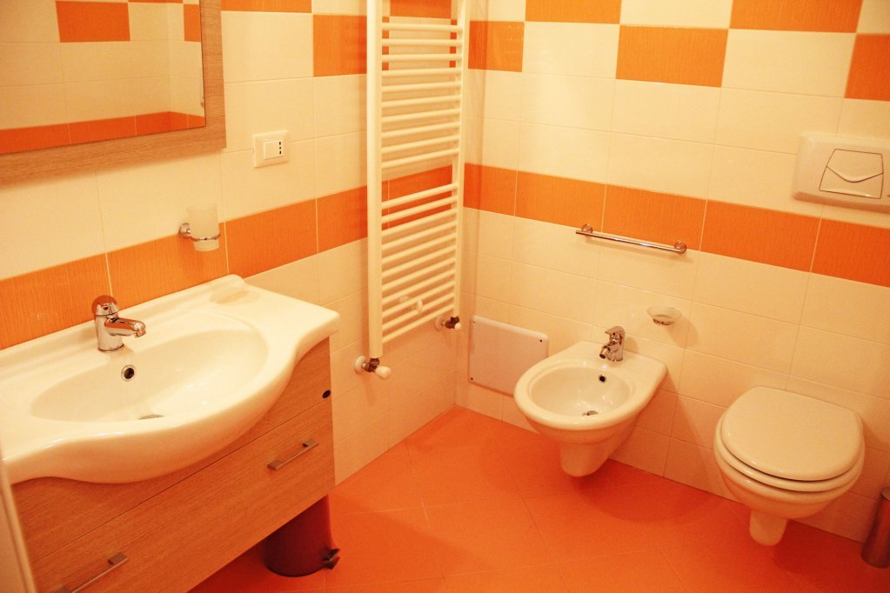 | 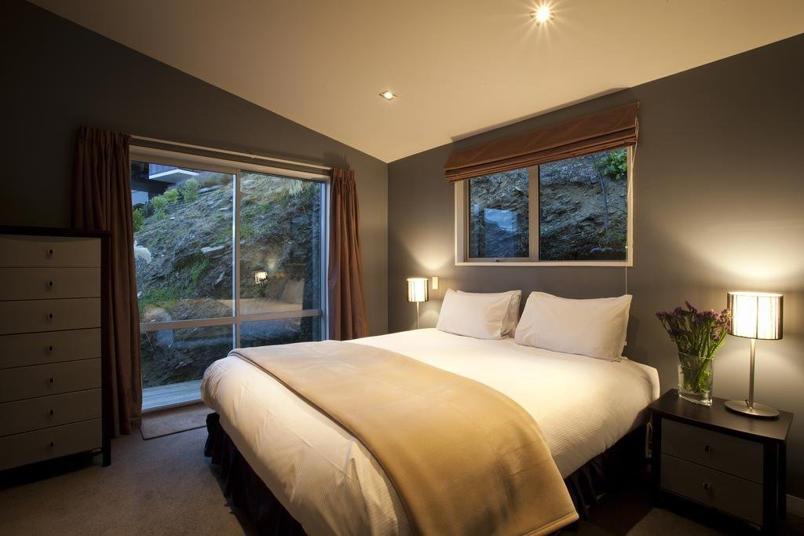

    - **11 images in `negative` set** for training the model. Those images should not contain any objects that we are interested in detecting
        
        Negative sample 1  |  Negative sample 2
        :-------------------------:|:-------------------------:
        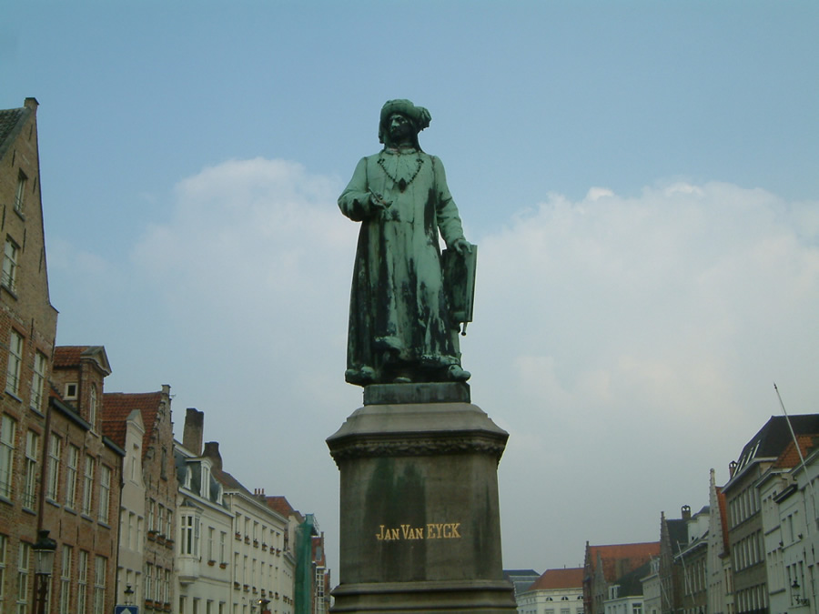 | 

    - **20 images in `testImages` set** for testing and evaluating the model. We have about 50/50 split between `bathroom` and `bedroom` pictures
    
        Bathroom test sample   |  Bedroom test sample
        :-------------------------:|:-------------------------:
        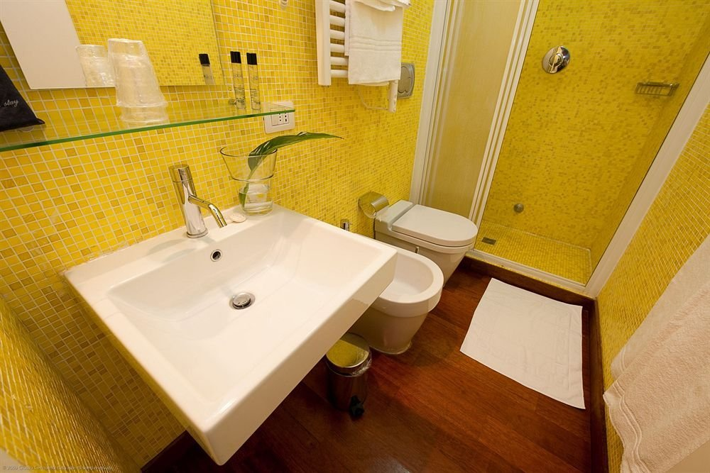 | 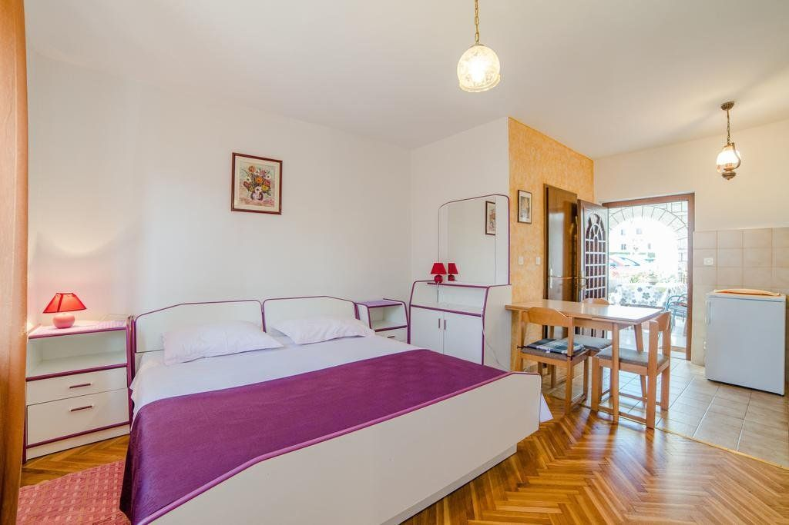

- After we tagged all of the images from `HotailorPOC2` dataset we analyzed them to verify how many tagged objects per each class we have. It is suggested to use about 20-30% of all data in dataset as test data. Looking at our numbers below we did quite ok but there's still some room for improvement

    object/class name | # of tagged objects in positive/train set   | # of tagged objects in test set | % of tagged objects in relation to all objects
    :-------------------------:|:-------------------------:|:-------------------------:|:-------------------------:
    sink | 46 | 10 | 18
    pillow | 98 | 27 | 22
    toilet | 34 | 7 | 17
    lamp | 69 | 18 | 21
    curtain | 78 | 16 | 17
    towel | 30 | 14 | 32
    tap | 44 | 9 | 17
    bed | 53 | 12 | 18

<br><br>

### 2.3. Training and evaluation results ###
[[back to the top]](#table-of-contents)

- After training and evaluating our model we achieved following results:

    ```
    Evaluating Faster R-CNN model for 20 images.
    Number of rois before non-maximum suppression: 550
    Number of rois  after non-maximum suppression: 87
    AP for            sink = 0.4429
    AP for          pillow = 0.1358
    AP for          toilet = 0.8095
    AP for            lamp = 0.5404
    AP for         curtain = 0.7183
    AP for           towel = 0.0000
    AP for             tap = 0.1111
    AP for             bed = 0.8333
    Mean AP = 0.4489
    ```
- As you can see above, some of the results are not too good. For example: `pillow` and `tap` average precision for test set is extremely low and for `towel` it even shows 0.0000 which may indicate some problems with our dataset or tagged objects. We will definitely need to look into it and check if we are able to somehow improve those results

- Even though the Mean Average Precision values are not perfect we still were able to get some decent results:

      
    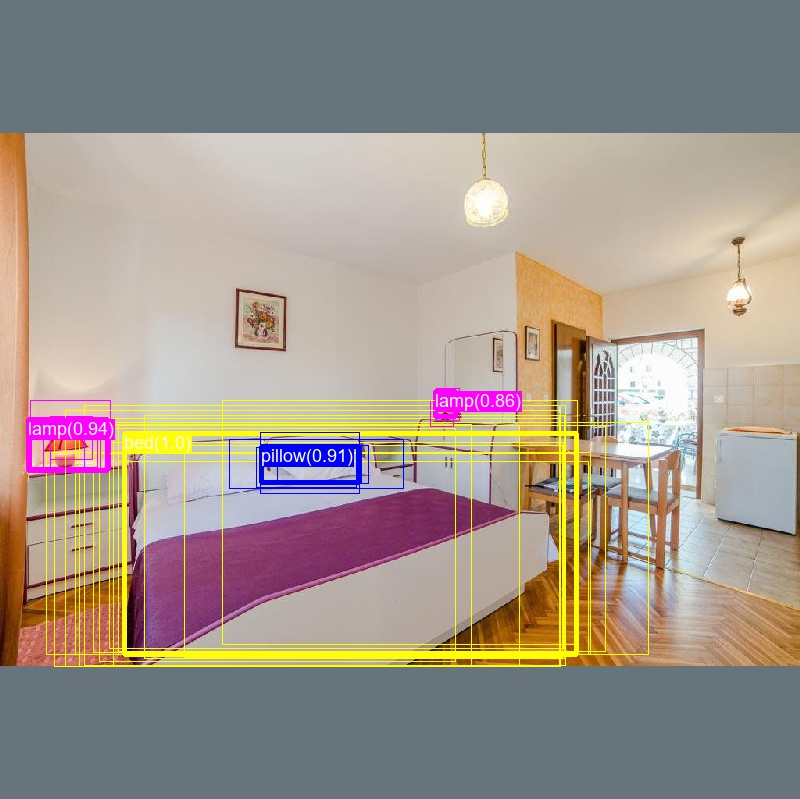
    
- Some of the results include mistakes. But those clearly look like anomalies which should be fairly easy to catch in further classification of picture type

    *Picture below shows how our model classified single region (yellow) as **`bed`** object although it's clearly not there:*   

    *Another picture shows how our model classified single region as **`towel`** object although it's clearly not there:*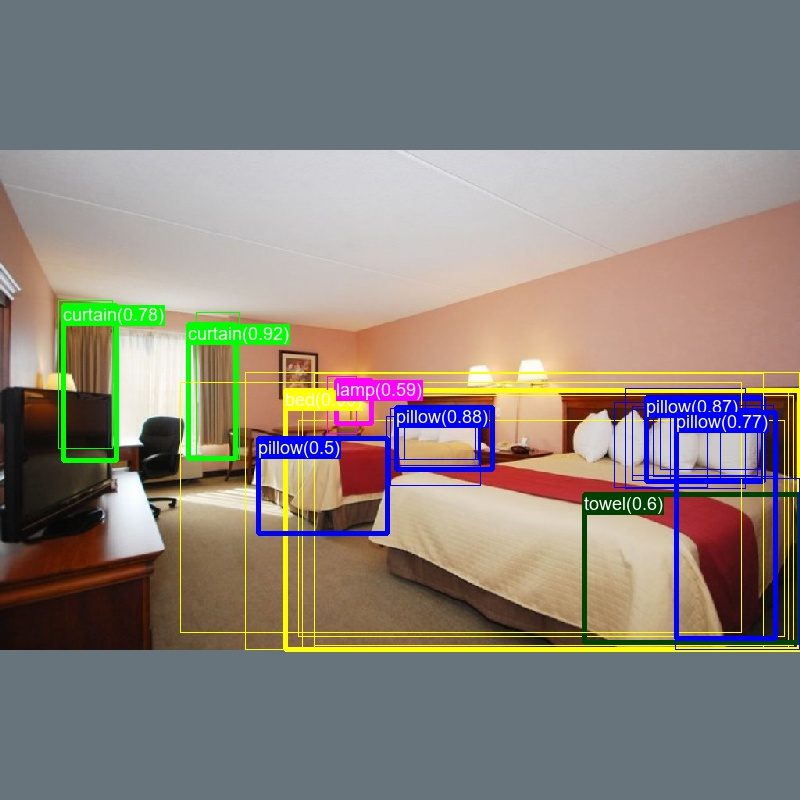

- Of course sometimes there are some really ugly results which may be hard to use for further classification:

    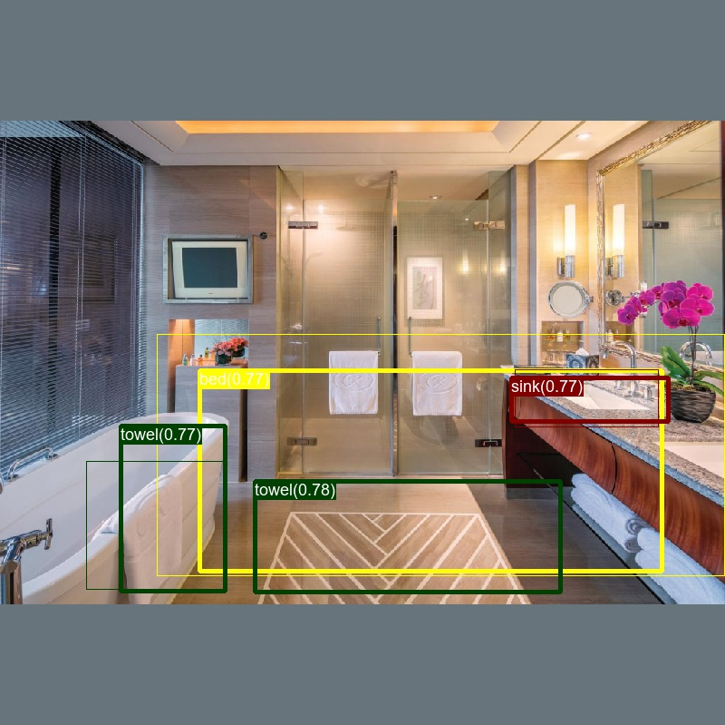

     *Next picture shows our model wasn't able to find any objects. We need to verify if it's because of wrongly tagged data in HotailorPOC2 or is it some kind of issue with [Region Proposal Network](https://www.quora.com/How-does-the-region-proposal-network-RPN-in-Faster-R-CNN-work) and it simply didn't find any [regions of interest](https://en.wikipedia.org/wiki/Region_of_interest) for further classification* 
    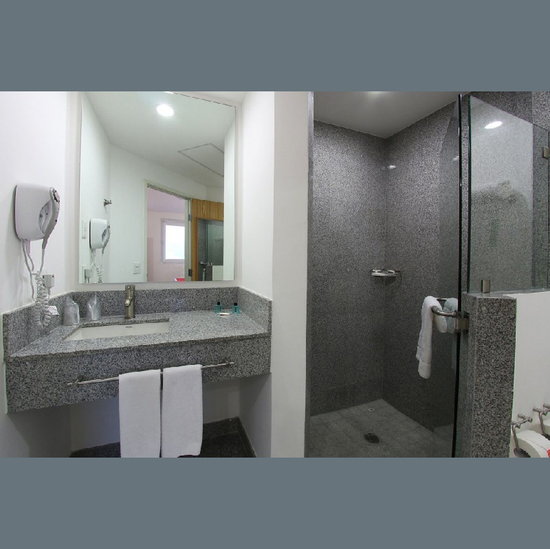

<br><br>

### 2.4. Using the model ### 
[[back to the top]](#table-of-contents)

Final model will be used in form of web service running on Azure and that's why I prepared a sample RESTful web service written with Python using Flask module. This web service makes use of our trained model and provides API which takes images as an input for evaluation and returns either a cloud of tags or tagged images. Project also describes how to easily deploy this web service to Azure Web Apps with custom Python environment and required dependencies.

You can find running web service hosted on Azure Web Apps [here](http://cntkpywebapptest1.azurewebsites.net/), and project with code and deployement scripts can be found on [GitHub](https://github.com/karolzak/CNTK-Python-Web-Service-on-Azure).

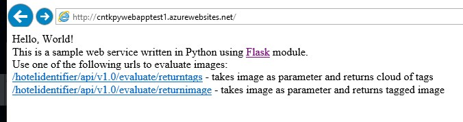

*Sample request and response in Postman:*
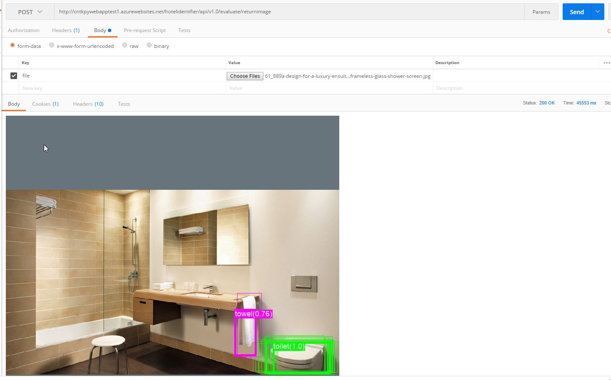

<br><br>


# 3. Run sample
### 3.1. Setup
[[back to the top]](#table-of-contents)


- **Download content of this repo**

    You can either clone this repo or just download it and unzip to some folder

- **Setup Python environment**

    In order for scripts to work you should have a proper Python environment. If you don't already have it setup then you should follow one of the online tutorials. To setup Python environment and all the dependencies required by CNTK on my local Windows machine, I used [scripted setup tutorial for Windows](https://docs.microsoft.com/en-us/cognitive-toolkit/setup-windows-binary-script). If you're using Linux then you might want to look into one of these [tutorials](https://docs.microsoft.com/en-us/cognitive-toolkit/Setup-CNTK-on-your-machine).
    Just bear in mind that this project was **developed and tested with CNTK 2.1 and it wasn't tested for any other version**.
    
    Even after setting up Python environment properly you might still witness some errors when running Python scripts. Most of those errors are related to missing modules or some 3rd party frameworks and tools (i.e. [GraphViz](http://www.graphviz.org/)). Missing modules can be easily [pip installed](https://packaging.python.org/tutorials/installing-packages/) and most of the required ones can be found in `requirements.txt` files for each folder with Python scripts.

    Please report if you'll find any errors or missing modules, thanks!

- **Download hotel pictures dataset (HotailorPOC2) and pretrained AlexNet model used for Transfer Learning**

    Go to [Detection/FasterRCNN](Detection/FasterRCNN) folder in the location were you unzipped this repo and run `install_data_and_model.py`. It will automatically download the `HotailorPOC2` dataset, pretrained AlexNet model and will generate mapping files required to train the model.
    
### 3.2. Train and evaluate the model using HotailorPOC2 sample dataset
[[back to the top]](#table-of-contents)

After you go through setup steps you can start training your model.

In order to do it you need to run `FasterRCNN.py`script located in [Detection/FasterRCNN](Detection/FasterRCNN). 

I'm working on Windows 10 so I run the script from Anaconda Command Prompt which should be installed during setup steps.

Bear in mind that training the model might take a lot of time depending on the type of machine you are using for training and if you're using GPU or CPU.

```
python FasterRCNN.py
```

**TIP:** If you don't own any machine with heavy GPU you can use one of the ready to go [Data Science Virtual Machine images in Azure](https://azuremarketplace.microsoft.com/en-us/marketplace/apps/microsoft-ads.windows-data-science-vm).

When the training and evaluation will be completed, you should see something similar to this:

```
Evaluating Faster R-CNN model for 20 images.
Number of rois before non-maximum suppression: 550
Number of rois  after non-maximum suppression: 87
AP for            sink = 0.4429
AP for          pillow = 0.1358
AP for          toilet = 0.8095
AP for            lamp = 0.5404
AP for         curtain = 0.7183
AP for           towel = 0.0000
AP for             tap = 0.1111
AP for             bed = 0.8333
Mean AP = 0.4489
```

Trained model, neural network topology and evaluated images (with plotted results) can later be found in `Output` folder located in `Detection/FasterRCNN`.

<br><br>

# 4. Code highlights
[[back to the top]](#table-of-contents)

- [config.py](Detection/FasterRCNN/config.py) - most of variables are set in this file

    - These variables are responsible for chosing a dataset that will be used to train the model. Most important variables here are  :

        ```Python    
        __C.CNTK.DATASET = "HotailorPOC2"   

        [..]  
    
        if __C.CNTK.DATASET == "HotailorPOC2": #name of your dataset Must match the name set with property '__C.CNTK.DATASET'
            __C.CNTK.MAP_FILE_PATH = "../../DataSets/HotailorPOC2" # dataset directory
            __C.CNTK.NUM_TRAIN_IMAGES = 82 # number of images in 'positive' folder
            __C.CNTK.NUM_TEST_IMAGES = 20 # number of images in 'testImages' folder
            __C.CNTK.PROPOSAL_LAYER_PARAMS = "'feat_stride': 16\n'scales':\n - 4 \n - 8 \n - 12"
        ```

    - `IMAGE_WIDTH` and `IMAGE_HEIGHT` are used to determine the input size of images used for training and later on for evaluation:

        ```Python
        __C.CNTK.IMAGE_WIDTH = 1000
        __C.CNTK.IMAGE_HEIGHT = 1000
        ```

    - `BASE_MODEL` defines which pretrained model should be used for transfer learning. Currently we used only AlexNet. In future we want to test it with VGG16 to check if we can get better results then with AlexNet 

        ```Python
        __C.CNTK.BASE_MODEL = "AlexNet" # "VGG16" or "AlexNet" or "VGG19"
        ```

- [requirements.txt](Detection/FasterRCNN/requirements.txt)

    - It holds all the dependencies required by my scripts and CNTK libraries to work. It can be used with `pip install` command to quickly install all the required dependencies ([more here](https://pip.pypa.io/en/stable/user_guide/#requirements-files))
    
        ```
        matplotlib==1.5.3
        numpy==1.13.3
        cntk==2.1
        easydict==1.6
        Pillow==4.3.0
        utils==0.9.0
        PyYAML==3.12
        ```

- [install_data_and_model.py](Detection/FasterRCNN/install_data_and_model.py)

    - This script does 3 things:
        - Downloads pretrained model specified in [config.py](Detection/FasterRCNN/config.py) which will be later used for transfer learning:
            
            ```Python
            #downloads pretrained model pointed out in config.py that will be used for transfer learning
            sys.path.append(os.path.join(base_folder, "..", "..",  "PretrainedModels"))
            from models_util import download_model_by_name
            download_model_by_name(cfg["CNTK"].BASE_MODEL)
            ```
        
        - Downloads and unzips our sample HotailorPOC2 dataset:

            ```Python
            #downloads hotel pictures classificator dataset (HotailorPOC2)
            #comment out lines bellow if you're using a custom dataset
            sys.path.append(os.path.join(base_folder, "..", "..",  "DataSets", "HotailorPOC2"))
            from download_HotailorPOC2_dataset import download_dataset
            download_dataset()    
            ```

        - Creates mappings and metadata for dataset:
            
            ```Python
            #generates metadata for dataset required by FasterRCNN.py script
            print("Creating mapping files for data set..")
            create_mappings(base_folder)
            ```

- [FasterRCNN.py](Detection/FasterRCNN/FasterRCNN.py)

    - We use this script for training and testing the model. It makes use of specific variables in [config.py](Detection/FasterRCNN/config.py). This script comes unmodified from original [CNTK repository on GitHub](https://github.com/Microsoft/CNTK) (version 2.1)


<br><br>
    
# 5. Use with custom dataset
[[back to the top]](#table-of-contents)

Although this project was prepared specifically for Hotailors case, it's based on one of the standard examples from original [CNTK repository on GitHub](https://github.com/Microsoft/CNTK) and thus it can be easily reused in any other scenario. You just need to follow steps bellow:

### 5.1. Setup ###  
[[back to the top]](#table-of-contents)
    
Follow steps number 1 and 2 from [setup instructions](#setup).

### 5.2. Prepare data ###  
[[back to the top]](#table-of-contents)

- #### Gather data for your dataset ####

    - Think what type of objects you would like to classify and prepare some images with those objects. The more the better but usually u should get some decent results even with 30-40+ samples per object. Remember that single image can have multiple objects (it was exactly like that in our case)
    
    - Make sure to use only good quality images in specific resolution 

    - Resolution we used for our project was 1000x1000 px but you can easily lower it depending on your scenario and needs. Just make sure to scale your images to this one specific resolution you will be working with. In our case the original images where much larger then 1000x1000 px but we scalled it down to match the longer side of image to 1000 px

    - It's not recommended to go beyond 1000x1000 px

<br>

- #### Create a dataset ####

    Create a new folder in `Datasets` directory and name it with whatever your datasets name is and inside that newly created folder create 3 another folders for your images:

    - `negative`

        Here you must add images which don't include any of the objects you will be looking for. The more the better but don't get crazy here, 10 to 20 images should more then enought. Those images will be used during training to show our model what is not interesting for us and should be treated as a background

    - `positive`

        Here you must add images that will be used to teach our model what kind of objects it should look for. The more the better but we should be able to see **some results with 30-40+ images per class/object** we would like to detect. Just bear in mind that **one image can have more then one object/class**.

    - `testImages`

        Those images will be used for testing of your trained model and to evaluate AP (Average Precission) percentage for each class. Just take 20-30 percent of images from `positive` folder and put them here. It's very important though to not duplicate any images between `positive` and `testImages` folders as it may corrupt the results

<br>

### 5.3. Tag images ###  
[[back to the top]](#table-of-contents)
    
In order to make your custom dataset ready to be used for training you will need to create some metadata with coordinates of objects and their names (classes)

Currently the best tool for tagging images is [Visual object Taging Tool](https://github.com/Microsoft/VoTT) but for this project I used simple Python scripts that can be found in the original CNTK 2.1 github repository (mine were fine tuned a bit):

- [C1_DrawBboxesOnImages.py](Detection/ImageTaggingTool/C1_DrawBboxesOnImages.py) - allows you to draw bounding boxes for all the objects which are interesting to you (present objects you wish to recognize).

    There is one variable you will need to change before running this script:

    ```Python
    #change it to your images directory. Run this script separately for each folder
    imgDir = "../../DataSets/HotailorPOC2/testImages"
    ```

    Important thing to mention here is to run this script only for `positive` and `testImages`. You don't need to do it for `negative` because there's actually nothing to tag there.

    After successfully running the script you should see something like that:

    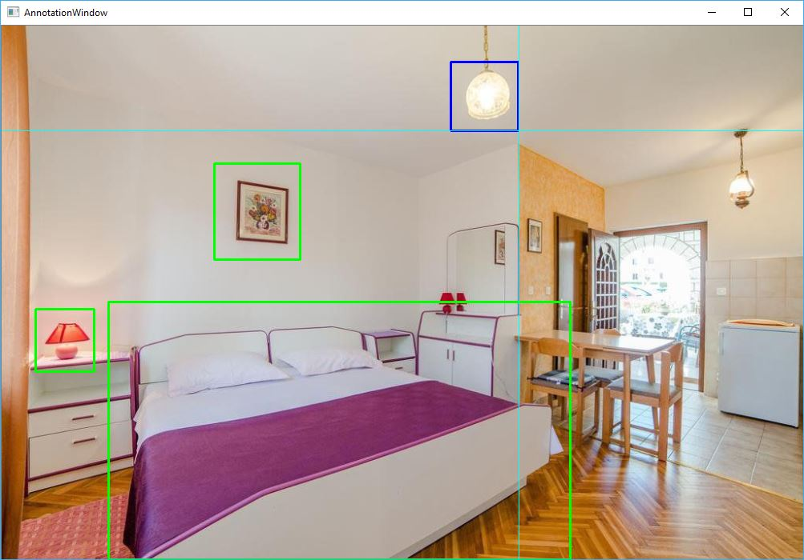

    Now just use your mouse to draw bounding boxes for every object.
    Some keyboard shortcuts should be helpful here:

    "u" - will erase last bounding box you draw

    "n" - will move you to next image in current folder

    "s" - will skip current image and delete all the bounding boxes for that image

<br>

- [C2_AssignLabelsToBboxes.py](Detection/ImageTaggingTool/C2_AssignLabelsToBboxes.py) - allows to review every bounding box you've marked with C1 script and label it with proper class name.

    Before running this script change those 2 variables:

    ```Python
    #change it to your images directory. Run this script separately for each folder
    imgDir = "../../DataSets/HotailorPOC2/testImages"

    #change it to your classes names
    classes = ["curtain", "pillow", "bed", "lamp", "toilet", "sink", "tap", "towel"]
    ```

    Again, same as in C1, run this script only for `positive` and `testImages`.
    
    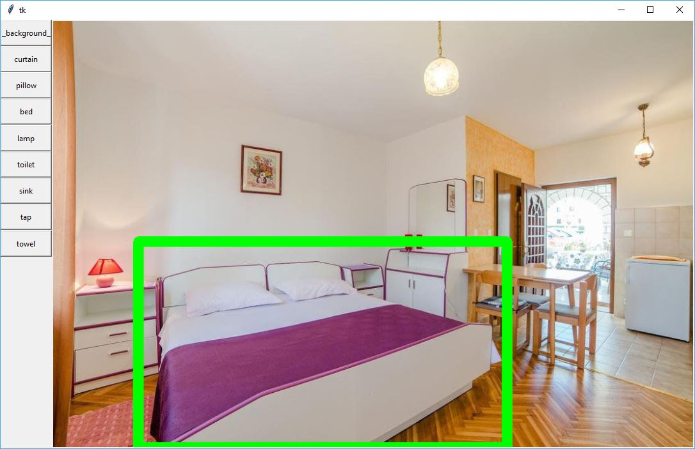

<br>

- [C3_VisualizeBboxes.py](Detection/ImageTaggingTool/C3_VisualizeBboxes.py) - I made this script based on C2 just to visualize bounding boxes for each image in dataset. It's very helpful when you are looking for mistakes within your dataset.

    Be sure to change `imgDir` variable to your directory:

    ```Python
    #change it to your images directory. Run this script separately for each folder
    imgDir = "../../DataSets/HotailorPOC2/testImages"
    ```

    Running C3 script will visualize bounding boxes for every image in directory and you should be able to see if everything is marked correctly:
    
    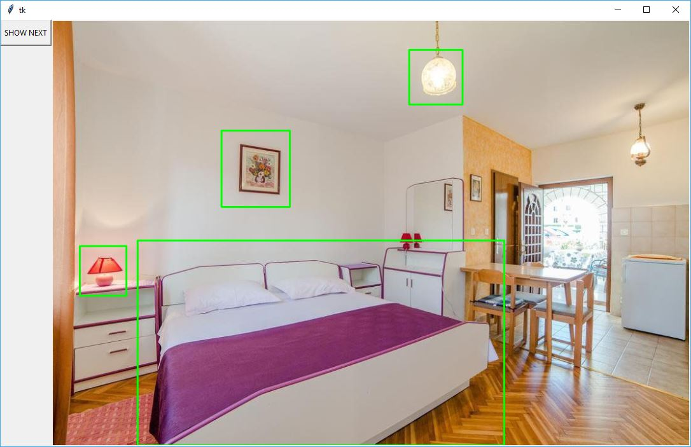
    
<br>

### 5.4. Download pretrained model and create mappings for custom dataset ###  
[[back to the top]](#table-of-contents)

In order to train the model we use transfer learning and we need to have a pretrained model for that. For this sample we use AlexNet model.

To download the model and create class and files mappings you can use [install_data_and_model.py](Detection/FasterRCNN/install_data_and_model.py) script and simply follow these steps:

- Make sure to [change variables](#change-variables) in your [config.py](Detection/FasterRCNN/config.py) file and make sure you set `__C.CNTK.MAP_FILE_PATH` variable to a proper directory:

    ```Python        
    if __C.CNTK.DATASET == "HotailorPOC2": #name of your dataset. Must match the name set with property '__C.CNTK.DATASET'
        __C.CNTK.MAP_FILE_PATH = "../../DataSets/HotailorPOC2" # your dataset directory
        __C.CNTK.NUM_TRAIN_IMAGES = 82 # number of images in 'positive' folder
        __C.CNTK.NUM_TEST_IMAGES = 20 # number of images in 'testImages' folder
        __C.CNTK.PROPOSAL_LAYER_PARAMS = "'feat_stride': 16\n'scales':\n - 4 \n - 8 \n - 12"
    ```

- Open [install_data_and_model.py](Detection/FasterRCNN/install_data_and_model.py) script and comment out those lines:

    ```Python 
    #downloads hotel pictures classificator dataset (HotailorPOC2)
    #comment out lines bellow if you're using a custom dataset
    sys.path.append(os.path.join(base_folder, "..", "..",  "DataSets", "HotailorPOC2"))
    from download_HotailorPOC2_dataset import download_dataset
    download_dataset()
    ```

- Run [install_data_and_model.py](Detection/FasterRCNN/install_data_and_model.py) script. Bear in mind that downloading the pretrained model may take few minutes or even more depending on your internet connection.

At this point your custom dataset should be ready for training.

<br>

### 5.5. Run training ###  
[[back to the top]](#table-of-contents)

- #### Change variables ####

    Edit [config.py](Detection/FasterRCNN/config.py) script and change following variables:

    - Change value of `__C.CNTK.DATASET`:        
        ```Python
        # set it to your custom dataset name
        __C.CNTK.DATASET = "HotailorPOC2" 
        ```

    - Change values of `__C.CNTK.IMAGE_WIDTH` and `__C.CNTK.IMAGE_HEIGHT` to much your custom dataset images resolution:        
        ```Python
        # set it to your custom datasets images resolution
        __C.CNTK.IMAGE_WIDTH = 1000
        __C.CNTK.IMAGE_HEIGHT = 1000 
        ```

    - Change values in following code to match your dataset name, your datasets directory location and to match your custom dataset images resolution:        
        ```Python
        if __C.CNTK.DATASET == "HotailorPOC2": #name of your dataset. Must match the name set with property '__C.CNTK.DATASET'
            __C.CNTK.MAP_FILE_PATH = "../../DataSets/HotailorPOC2" # your dataset directory
            __C.CNTK.NUM_TRAIN_IMAGES = 82 # number of images in 'positive' folder
            __C.CNTK.NUM_TEST_IMAGES = 20 # number of images in 'testImages' folder
        ```

<br>

- **Train and test your model with [FasterRCNN.py](Detection/FasterRCNN/FasterRCNN.py) script** 

    Run `FasterRCNN.py` script and wait till the training and testing finishes.

    Training may take even couple hours depending on your hardware setup. It's is best to use high performing GPU's for that kind of purposes. 

    **TIP:** If you don't own any machine with heavy GPU you can use one of the ready to go [Data Science Virtual Machine images in Azure](https://azuremarketplace.microsoft.com/en-us/marketplace/apps/microsoft-ads.windows-data-science-vm).

    If you won't be satisfied with training results then try fine tunning the variables and cleaning your dataset if necessary and then rerun the training.

<br>

### 5.6. Deploy your model ###  
[[back to the top]](#table-of-contents)

When you will find yourself satisfied with your model and you would like to get to know how to use it with RESTful Python web service and deploy it to Azure Web Apps, then check out [this repository](https://github.com/karolzak/CNTK-Python-Web-Service-on-Azure).


